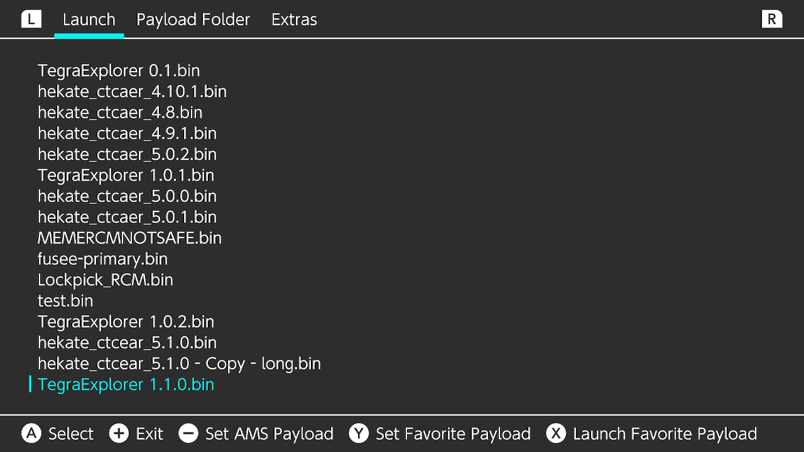

# Payload_Launcher
Uses the reboot to payload system to launch payloads.

Works on atmosphere. Should also work on sx and reinx.

### How to install
1. Drop the .nro file in the switch folder
2. Create a folder called `payloads` on the root on the sd card and place your payload.bin files in there

### Credits

Uses part of the atmosphere code from [the atmosphere repo](https://github.com/Atmosphere-NX/Atmosphere/blob/master/troposphere/reboot_to_payload/source/main.c). Licence of the atmosphere repo is included as AMS_LICENCE.
